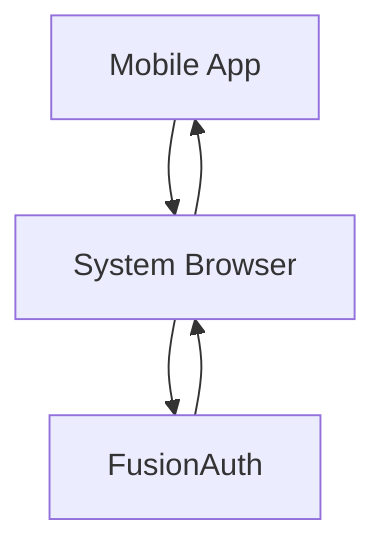

# Authentication Architecture Diagram

This architecture focuses on the current implementation where the mobile app talks directly to FusionAuth.

## Components

- Mobile App (Expo/React Native)
- System Browser (hosted login experience)
- FusionAuth (authorization server + identity provider)

## Diagram

## Current Request Boundaries

- Browser is used only for user authentication UI and redirect handoff.
- Token exchange is executed by mobile app code (public client + PKCE).
- Session state is persisted client-side in app storage via auth context helpers.

## Current Scope

The project intentionally demonstrates native OAuth + PKCE end-to-end with a mobile-first architecture.
