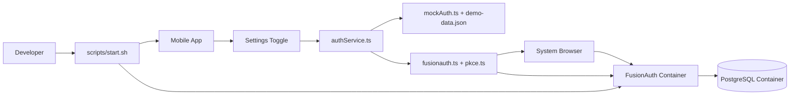

# System Architecture

## Overview

This repository provides a complete local development environment for a mobile authentication demo:

- React Native mobile app with two auth modes (mock and FusionAuth)
- FusionAuth + PostgreSQL in Docker

The system is designed so developers can run everything locally with one command and switch auth behavior without rewriting app logic.

## High-Level Components

- `apps/mobile-app`: React Native app (Expo dev client)
- `infra/docker-compose.yml`: FusionAuth + PostgreSQL runtime
- `infra/kickstart/kickstart.json`: initial FusionAuth bootstrap
- `scripts/update.sh`: clones/updates mobile app and checks out feature branch
- `scripts/start.sh`: end-to-end startup orchestration

## Architecture Diagram

## Runtime Interaction Model

1. `start.sh` updates mobile code and starts infrastructure.
2. Mobile app launches and reads auth mode from persistent storage.
3. Login routes through `authService.ts`.
4. Depending on mode:
   - mock mode: credentials validated against demo config
   - FusionAuth mode: OAuth Authorization Code + PKCE flow
5. Both flows return a unified payload shape used by existing session logic.

## Why This Design

- Keeps existing mock/demo behavior intact for fast local development.
- Adds real OAuth flow without rewriting the auth/session architecture.
- Minimizes conditional logic spread by centralizing strategy selection in `authService.ts`.
