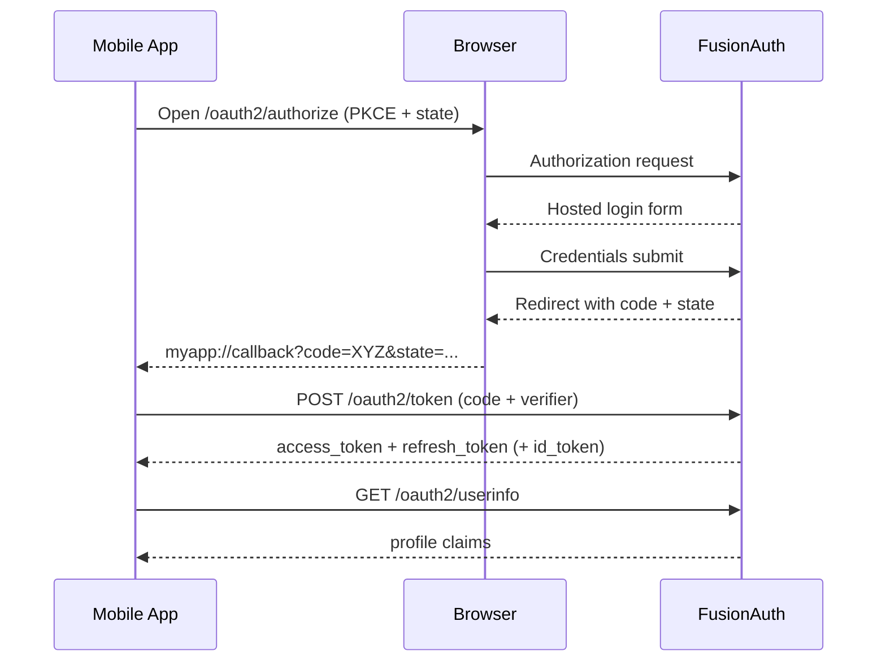

# Auth Flow Deep Dive

This document describes the real FusionAuth login path implemented in the mobile app and how it falls back to mock/demo modes.

## Source of Truth in Code

- `apps/mobile-app/app/services/auth/authService.ts`
- `apps/mobile-app/app/services/auth/fusionauth.ts`
- `apps/mobile-app/app/services/auth/pkce.ts`
- `apps/mobile-app/app/screens/LoginScreen.tsx`
- `apps/mobile-app/app/context/AuthContext.tsx`

## End-to-End Flow (FusionAuth Mode)

1. User taps **Sign In** in `LoginScreen`.
2. `LoginScreen` calls `login(email, password)` from `authService.ts`.
3. `authService.ts` resolves effective mode using `getAuthMode()`:
   - `demo` overrides all
   - else `fusionauth`
   - else `mock`
4. In `fusionauth` mode, `fusionAuthLogin(emailHint)` runs.
5. `pkce.ts` generates:
   - `code_verifier` (high entropy random string)
   - `code_challenge` (`BASE64URL(SHA256(verifier))`)
6. App builds authorize URL:
   - `GET {FUSIONAUTH_BASE_URL}/oauth2/authorize`
   - includes `client_id`, `redirect_uri`, PKCE params, `state`, `scope`
7. App opens browser auth session via `expo-web-browser`.
8. User authenticates in hosted FusionAuth UI.
9. FusionAuth redirects to deep link:
   - `myapp://callback?code=...&state=...`
10. App parses callback and validates `state`.
11. App exchanges code:
   - `POST {FUSIONAUTH_BASE_URL}/oauth2/token`
   - body includes `grant_type`, `client_id`, `code`, `redirect_uri`, `code_verifier`
12. FusionAuth returns tokens (`access_token`, `refresh_token`, optionally `id_token`, `expires_in`).
13. App optionally calls `/oauth2/userinfo` to map stable `user.id/email`.
14. `LoginScreen` maps result to `setAuthSession(...)` in `AuthContext`.
15. Authenticated state flips and app navigates to the signed-in area.

## Sequence Diagram

## Real Request Example

Authorize:

`http://localhost:9011/oauth2/authorize?client_id=11111111-1111-1111-1111-111111111111&redirect_uri=myapp%3A%2F%2Fcallback&response_type=code&code_challenge=<challenge>&code_challenge_method=S256&scope=openid%20offline_access%20profile%20email&state=<state>`

Token exchange body:

`grant_type=authorization_code&client_id=11111111-1111-1111-1111-111111111111&code=<code>&redirect_uri=myapp%3A%2F%2Fcallback&code_verifier=<verifier>`

## Where This Can Fail

- `invalid_client`: wrong `client_id`
- `invalid_redirect_uri`: redirect mismatch
- `invalid_pkce_code_challenge`: malformed challenge
- `invalid_grant`: bad/expired/reused code or verifier mismatch
