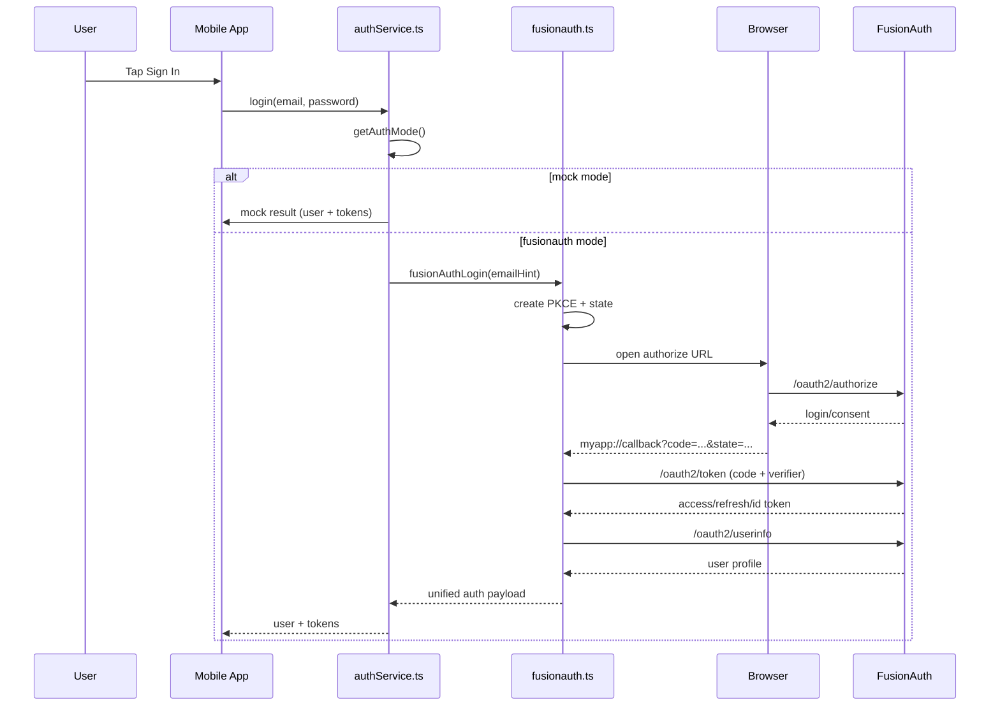

# Authentication Flow

## Modes

The app supports two login modes selected from Settings:

- `mock`: local demo credentials/tokens
- `fusionauth`: OAuth 2.0 Authorization Code + PKCE

Mode is persisted and read by `getAuthMode()`.
Demo Mode overrides all other modes, so enabling it forces local mock login behavior.

## End-to-End Login Sequence

## Step-by-Step (FusionAuth Mode)

1. `LoginScreen` calls `authService.login(email, password)`.
2. `authService` reads persisted mode.
3. For `fusionauth`, `fusionAuthLogin`:
   - creates PKCE verifier/challenge
   - creates CSRF `state`
   - keeps `code_verifier` in in-memory function scope until token exchange
   - builds `/oauth2/authorize` URL
4. Browser session starts via `expo-web-browser`.
5. FusionAuth redirects to `myapp://callback` with authorization `code`.
6. App validates returned `state`.
7. App exchanges `code` at `/oauth2/token` with `code_verifier`.
8. App fetches `/oauth2/userinfo` for stable user identity.
9. Returns normalized payload:
   - `user: { id, email }`
   - `access_token`
   - `refresh_token?`

## Navigation/Session Impact

No special navigation rewrite is required. Existing session state is set through `setAuthSession`, so authenticated routing continues to work as before.
