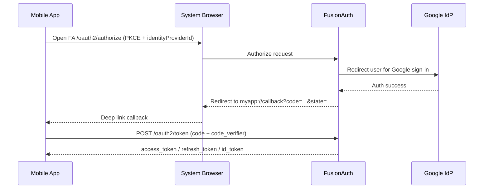

# Google SSO via FusionAuth

## Overview

This app supports Google Sign-In through FusionAuth using OAuth2 Authorization Code Flow + PKCE.  
The mobile app never talks to Google directly. It starts at FusionAuth, which brokers authentication to Google Identity Provider (IdP), then returns to the app callback URI.

Implemented entry points:

- `apps/mobile-app/app/screens/LoginScreen.tsx` (`onGoogleLogin`)
- `apps/mobile-app/app/services/auth/authService.ts` (`loginWithGoogle`)
- `apps/mobile-app/app/services/auth/fusionauth.ts` (`fusionAuthGoogleLogin`)

## Flow Diagram

## Configuration

Mobile app env (`apps/mobile-app/.env`):

- `EXPO_PUBLIC_FUSIONAUTH_URL` - FusionAuth base URL (for example `http://localhost:9011`)
- `EXPO_PUBLIC_CLIENT_ID` - FusionAuth Application ID (client ID)
- `EXPO_PUBLIC_REDIRECT_URI` - app callback URI (for example `myapp://callback`)
- `EXPO_PUBLIC_GOOGLE_IDP_ID` - FusionAuth Google Identity Provider ID

FusionAuth high-level setup:

1. Configure Google as an Identity Provider in FusionAuth.
2. Capture the FusionAuth Google IdP UUID.
3. Set `EXPO_PUBLIC_GOOGLE_IDP_ID` in mobile env.
4. Ensure FusionAuth application has callback `myapp://callback`.
5. Keep PKCE policy enabled for the app.

## Implementation Details

### PKCE

`apps/mobile-app/app/services/auth/pkce.ts` generates:

- `code_verifier` (random, high entropy)
- `code_challenge` (`S256`, base64url)

### Authorize request

`fusionAuthGoogleLogin` builds:

- `GET {FUSIONAUTH_BASE_URL}/oauth2/authorize`
- required params:
  - `client_id`
  - `redirect_uri`
  - `response_type=code`
  - `code_challenge`
  - `code_challenge_method=S256`
  - `scope=openid profile email`
  - `state`
  - `identityProviderId=<EXPO_PUBLIC_GOOGLE_IDP_ID>`

### Redirect handling

The app opens system browser auth session and listens for:

- `myapp://callback?code=...&state=...`

It validates state and extracts authorization code.

### Token exchange

`fusionauth.ts` posts to:

- `POST {FUSIONAUTH_BASE_URL}/oauth2/token`

with:

- `grant_type=authorization_code`
- `client_id`
- `code`
- `redirect_uri`
- `code_verifier`

Tokens returned are mapped to unified payload and persisted via `AuthContext.setAuthSession(...)`.

## Security Considerations

- PKCE protects authorization code exchange for public mobile clients.
- System browser (`expo-web-browser`) is required to use trusted provider session handling and avoid embedded-webview credential capture risks.
- Tokens are stored through existing app auth storage (`AuthContext` MMKV keys), not plain text logs.
- Google SSO path reuses existing auth mode and session logic, so logout and authenticated state behavior remain consistent.
