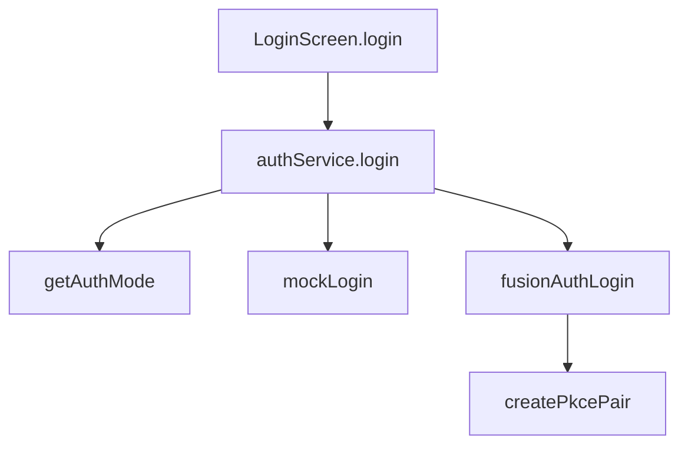

# Code Walkthrough

## Core Auth Files

### `app/services/auth/pkce.ts`

Purpose:

- Generates OAuth PKCE values and request state.

Key exports:

- `createPkcePair()`: returns verifier/challenge pair
- `createOAuthState()`: random anti-CSRF state value

### `app/services/auth/fusionauth.ts`

Purpose:

- Executes full OAuth + PKCE login against FusionAuth.

Core responsibilities:

- build authorize URL
- open browser auth session
- parse callback deep link
- exchange code for tokens
- normalize response shape

### `app/services/auth/authService.ts`

Purpose:

- Strategy dispatcher that chooses mock or FusionAuth login.

Why it matters:

- keeps UI layer simple
- prevents duplicated mode checks in screens

### `app/screens/LoginScreen.tsx`

Purpose:

- Collect credentials, trigger login, and commit session.

Integration point:

- calls `authService.login(...)`
- maps normalized tokens into `setAuthSession(...)`

## Supporting Files

- `app/services/auth/authMode.ts`: persistent toggle value
- `app/services/auth/mockAuth.ts`: wraps existing mock behavior
- `app/screens/SettingsScreen.tsx`: user-facing “Enable FusionAuth Login” switch

## Call Graph

