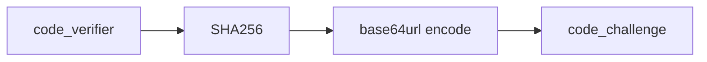

# PKCE Deep Dive

PKCE is central to this project's real OAuth mode.

## Why PKCE Is Required Here

This mobile app is a public client (no trusted client secret on device).  
Without PKCE, an intercepted authorization code could be replayed by an attacker at `/oauth2/token`.

PKCE prevents this by binding token exchange to a one-time secret (`code_verifier`) known only to the initiating app instance.

## Current Implementation

Code locations:

- `apps/mobile-app/app/services/auth/pkce.ts`
- `apps/mobile-app/app/services/auth/fusionauth.ts`

### `code_verifier`

- Generated in `createPkcePair()` using random bytes over RFC-friendly charset.
- Length in current implementation: 64 chars.
- Lifetime: in-memory only, held in function scope until token exchange.

### `code_challenge`

- Derived from verifier:
  1. SHA256 digest
  2. base64 encoding
  3. base64url normalization (`+` -> `-`, `/` -> `_`, trim `=`)
- Sent to `/oauth2/authorize` with:
  - `code_challenge=<value>`
  - `code_challenge_method=S256`

### Verification in FusionAuth

At `/oauth2/token`, FusionAuth recomputes challenge from submitted `code_verifier` and compares it with challenge from authorize request.  
Mismatch results in `invalid_pkce_code_challenge` or `invalid_grant`.

## Security Risks Without PKCE

- Authorization code interception replay
- Increased deep-link interception risk in mobile contexts
- Confidential-client assumptions leaking into public mobile architecture

## Diagram

## Practical Debug Notes

- If authorize succeeds but token fails, verify the same verifier instance is used.
- Ensure no mutation/encoding mismatch between generated and submitted verifier.
- Confirm `code_challenge_method` remains `S256` on authorize request.
